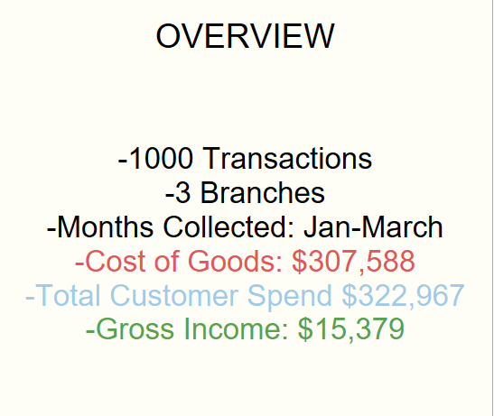
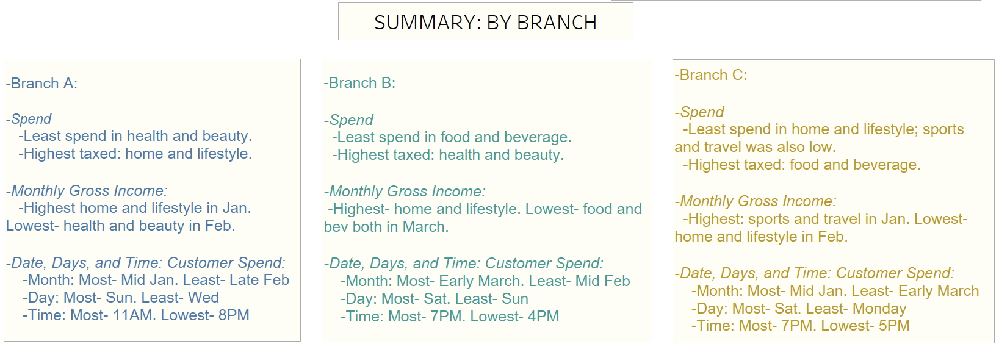
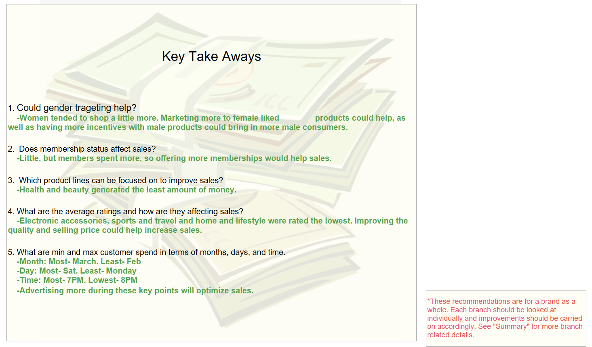

# Supermarket-Store-Optimization

## ABSTRACT

Exploratory analysis to discover and investigate manipulable factors to optimize sales of a supermarket brand using 2019 sales data collected from one thousand customers over three branches. 

## Purpose

From 2010- 2016, I managed seven restaurants which assisted in growing my business analytical skills and interpersonal communication skills. While most of the stores were meeting typical sales expectations, there was definitely room for improvement. Through sales analysis, I was able to investigate what the issues were and work towards increasing profit margins by adjusting key features and marketing. 
From my experience in business management, I hope to help this supermarket brand achieve its optimal growth by finding adjustable variables and suggesting improvements. 

## Analysis 

<a href="https://public.tableau.com/app/profile/kishan.patel2847/viz/SupermarketSalesOptimizationPresentationStory/SuperMarketBusinessAnalysis">Presentation/Full Analysis</a>

<a href="https://public.tableau.com/app/profile/kishan.patel2847/viz/SupermarketSalesOptimizationDash1SpendLocationandPaymentType/1_PaymentType">Dash 1: Spend Location and Payment Type</a>

<a href="https://public.tableau.com/app/profile/kishan.patel2847/viz/SupermarketSalesOptimizationDash2GenderandMemberStatusDistribution/2_GenderandMember">Dash 2: Gender and Member Status Distribution</a>

<a href="https://public.tableau.com/app/profile/kishan.patel2847/viz/SupermarketSalesOptimizationDash3BrandSpendingbyProductLineandTax/3_TotalSpend">Dash 3: Brand Spending by Product Line and Tax</a>

<a href="https://public.tableau.com/app/profile/kishan.patel2847/viz/SupermarketSalesOptimizationDash4BrandSpendingbyProductLineandTax/4_TotalSpendbyBranch">Dash 4: Brand Spending by Product Line and Tax</a>

<a href="https://public.tableau.com/app/profile/kishan.patel2847/viz/SupermarketSalesOptimizationDash5ProductLineRatingsGenderMemberStatusInfluences/5_TotalspendbyProducttype">Dash 5: Product Line: Ratings, Gender, Member Status Influences</a>

<a href="https://public.tableau.com/app/profile/kishan.patel2847/viz/SupermarketSalesOptimizationDash6CostofGoodsandGrossIncome/6_CostofGoodsandIncome">Dash 6: Cost of Goods and Gross Income</a>

<a href="https://public.tableau.com/app/profile/kishan.patel2847/viz/SupermarketSalesOptimizationDash7SpendingbyDayoftheWeek/7_DayLine">Dash 7: Spending by Day of the Week</a>

<a href="https://public.tableau.com/app/profile/kishan.patel2847/viz/SupermarketSalesOptimizationDash8SpendingbyStoreHours/8_Timeline">Dash 8: Spending by Store Hours</a>

## Summary

## Key Take Aways

